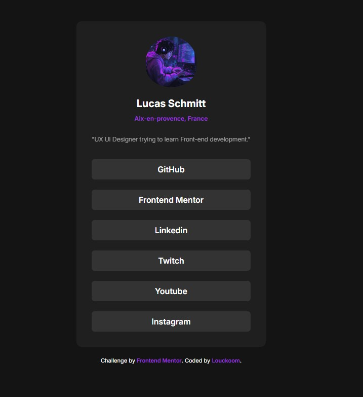

# Frontend Mentor - Social links profile solution

This is a solution to the [Social links profile challenge on Frontend Mentor](https://www.frontendmentor.io/challenges/social-links-profile-UG32l9m6dQ). Frontend Mentor challenges help you improve your coding skills by building realistic projects. 

## Table of contents

- [Overview](#overview)
  - [The challenge](#the-challenge)
  - [Screenshot](#screenshot)
  - [Links](#links)
- [My process](#my-process)
  - [Built with](#built-with)
  - [What I learned](#what-i-learned)
  - [Continued development](#continued-development)
  - [Useful resources](#useful-resources)
- [Author](#author)
- [Acknowledgments](#acknowledgments)

## Overview

### The challenge

The challenge is to build out this social links profile and get it looking as close to the design as possible.

You can use any tools you like to help you complete the challenge. So if you've got something you'd like to practice, feel free to give it a go.

Users should be able to:

- See hover and focus states for all interactive elements on the page

### Screenshot

### Links

- Solution URL: [https://github.com/Louckoom/Social_Link_Card]
- Live Site URL: [https://louckoom.github.io/Social_Link_Card/]
## My process

- Begin with the adjustment of the HTML.
- Then use Div to group certain element like the top part with images and titles and links in a differents Div group.
- Import Inter font.
- Begin CSS for the card part.
- Finished CSS Styling using Purple and grey colors.
- add real links in the HTML and add color change hover interation.

### Built with

- Semantic HTML5 markup
- CSS custom properties
- Flexbox

### What I learned

I learn to personalize my design using a reference as inspiration and i've create my own social link profile.

### Continued development

- Want to add Socials links icons on the links part. (Improvement)
- Still want to learn more about layout and responsive design, and hope to get more specialized over time.

### Useful resources

- [Flexbox Froggy](https://flexboxfroggy.com/#fr) - This helped me understand more flexbox concepts.

## Author

- Frontend Mentor - [@Louckoom](https://www.frontendmentor.io/profile/Louckoom)
- Twitch - [@luckyciel](https://www.twitch.tv/luckyciel)

## Acknowledgments

Did all by myself.